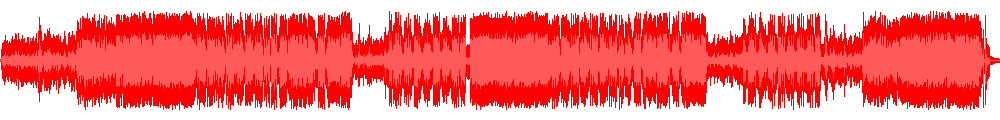

# Wavedown

A utility that transforms a stream of raw PCM 16bit LE data into a fixed-length waveform representation, written in Rust.



The tool `wavedown` determines the high-and-low peaks of the input audio stream (PCM 16bit LE) and produces a specified number of samples. The resulting data can then be stored or consumed by other applications.


## Building with Cargo

The easiest way to build `wavedown` from source is using Cargo:

```
$ cargo build --release
```


## Usage

The command line structure to run `wavedown` is as follows (run `wavedown --help`):

```
USAGE:
    wavedown [OPTIONS] --samples <SAMPLES> [ARGS]

FLAGS:
    -h, --help       Prints help information
    -V, --version    Prints version information

OPTIONS:
    -p, --precision <PRECISION>    Sets the floating point precision [default: 7]
    -s, --samples <SAMPLES>        Sets the number of samples to output
    -t, --type <TYPE>              Sets the type of the output values [default: short]  [values: byte, short, float]

ARGS:
    <INPUT>     Sets the input file [default: -]
    <OUTPUT>    Sets the output file [default: -]
```

The only required flag is `--samples`, specifying the number of samples to be extracted from the audio stream. The flag `--type` sets the output type and supports `byte` (signed 8bit), `short` (signed 16bit, default), and `float`. In case of `float`, the resulting values are normalized to the range (-1; +1). The precision can be controlled using the `--precision` flag.

By default, `wavedown` reads from standard input and writes to standard output. Alternatively, the first and second argument represent the input and output files, respectively. A dash ("-") tells `wavedown` to use the standard IO streams.

The output lists two numbers per sample (min, max) in the specified format, one line per sample:

```
-0.0108 0.0139
-0.0956 0.1149
-0.1810 0.1735
[...]
```


## Examples

The following command reads PCM data from the file `in.dat` and produces 1000 samples which are stored in the file `out.txt` in floating point format with a precision of 4 digits after the decimal point:

```
$ waveform in.dat out.txt --samples 1000 --type float --precision 4
```

`wavedown` can be paired with `ffmpeg` easily, making it straightforward to obtain waveform data from audio files. Running the following command will transform the file `song.mp3` into a series of 1000 samples, following the format from the previous example:

```
$ ffmpeg -hide_banner -loglevel panic -i song.mp3 -ac 1 -map 0:a -c:a pcm_s16le -f data - | waveform - out.txt --samples 1000
```

## License

See [LICENSE.txt](LICENSE.txt).

